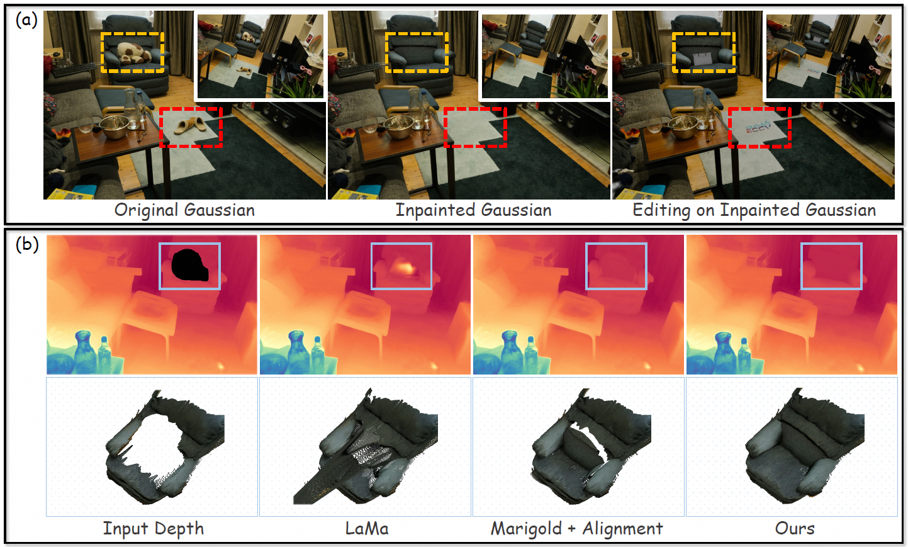
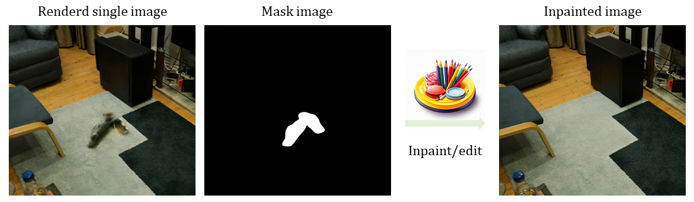

<p align="center">

  <h2 align="center">InFusion: Inpainting 3D Gaussians via Learning Depth Completion from Diffusion Prior</h2>
  <p align="center">
    <a href="https://johanan528.github.io/"><strong>Zhiheng Liu*</strong></a>
    ·
    <a href="https://ken-ouyang.github.io/"><strong>Hao Ouyang*</strong></a>
    ·
    <a href="https://github.com/qiuyu96"><strong>Qiuyu Wang</strong></a>
    ·
    <a href="https://felixcheng97.github.io/"><strong>Ka Leong Cheng</strong></a>
    ·
    <a href="https://jiexiaou.github.io/"><strong>Jie Xiao</strong></a>
    ·
    <a href="https://scholar.google.com/citations?user=Mo_2YsgAAAAJ&hl=zh-CN"><strong>Kai Zhu</strong></a>
    ·
    <a href="https://xuenan.net/"><strong>Nan Xue</strong></a>
    ·
    <a href="https://scholar.google.com/citations?user=8zksQb4AAAAJ&hl=zh-CN"><strong>Yu Liu</strong></a>
    ·
    <a href="https://shenyujun.github.io/"><strong>Yujun Shen</strong></a>
    ·
    <a href="https://staff.ustc.edu.cn/~forrest/"><strong>Yang Cao</strong></a>
    <br>
    <br>
        <a href="http://arxiv.org/abs/2404.11613"></a>
        <a href='https://johanan528.github.io/Infusion/'></a>
    <br>
    <b> USTC |&nbsp;HKUST |&nbsp;Ant Group |&nbsp;Alibaba Group  </b>
  </p>

  <table align="center">
    <tr>
    <td>
      
    </td>
    </tr>
  </table>

## News
* **[2024.4.18]** 🔥 Release paper, inference code, and pretrained checkpoint.
* **[On-going]** Clean and organize the masks corresponding to the dataset used in the experiments.
* **[On-going]** Scale up the model with more training data and release stronger models as the foundation model for downstream tasks.
* **[To-do]** Release training code.

## Installation
Install with `conda`: 
```bash
conda env create -f environment.yaml
conda activate infusion
```
* 🛠️ For rendering depth, we use the *diff-gaussian-rasterization-confidence* from [FSGS](https://github.com/VITA-Group/FSGS/tree/main/submodules/diff-gaussian-rasterization-confidence), thanks to their work! :)
## Download Checkpoints
Download the Infusion checkpoint and put it in the 'checkpoints' folder: 
* [HuggingFace](https://huggingface.co/Johanan0528/Infusion/tree/main)

## Data Preparation
Our experiments are conducted on the datasets provided by [Mip-NeRF](https://jonbarron.info/mipnerf360/), [Instruct-NeRF2NeRF](https://drive.google.com/drive/folders/1v4MLNoSwxvSlWb26xvjxeoHpgjhi_s-s?usp=share_link), and [SPIn-NeRF](https://drive.google.com/drive/folders/1N7D4-6IutYD40v9lfXGSVbWrd47UdJEC?usp=share_link). 
We will upload the masks used in the experiments and the challenge scene we shot ourselves in a few days.

Taking "garden" in [Mip-NeRF](https://jonbarron.info/mipnerf360/) as an example, each scene folder should be organized as follows.
```
garden
├── images # RGB data
│   ├── DSC07956.JPG
│   ├── DSC07957.JPG
│   └── ...                   
├── seg # Mask 
│   ├── DSC07956.JPG
│   ├── DSC07957.JPG
│   └── ... 
│   # The part that needs to be inpainted is white
└── sparse # Colmap
│   └── 0
│       └── ...
```


* 🛠️ You can prepare your own data according to such a structure. In addition, accurate masks are very important. Here, we recommend two image segmentation tools: [Segment and Track Anything](https://github.com/z-x-yang/Segment-and-Track-Anything) and [Grounded SAM](https://github.com/IDEA-Research/Grounded-Segment-Anything).

* 🛠️ To obtain camera parameters and initial point cloud, please refer to 'convert.py' in [Gaussian-Splatting](https://github.com/graphdeco-inria/gaussian-splatting/tree/main) :)
## Instructions
The entire pipeline is divided into three stages: 
* Train the Incomplete Gaussians. 
* Inpaint Gaussians via Diffusion Prior.
* Combine Inpainted Gaussians and Incomplete Gaussians.
### 🌺 Stage 1
Use pre-annotated masks to train incomplete Gaussians.
```bash
cd gaussian_splatting
# Train incomplete Gaussians
python train.py -s <path to scene folder> -m <path to output folder> -u nothing --mask_training
#--color_aug

# Obtain c2w matrix, intrinsic matrix, incomplete depth, and rgb rendering image
python render.py -s <path to scene folder> -m <path to output folder> -u nothing
```
* 🛠️ Tip: Sometimes, the rendered depth has too many empty points. Maybe you can use `--color_aug` during training, which will randomly select the background color when rendering depth, which may make the depth map more reliable.

* 🛠️ Recently, some works focused on how to segment Gaussians. This is not the focus of this work, so a relatively simple method was chosen. :)

### 🌺 Stage 2
Inpaint Gaussians using depth inpainting model.
* 📢 You need to select a **single image** and in *'path to output folder/train/ours_30000/renders'* and mark the area that needs to be inpainted and save it as **'mask.png'**. (*It doesn’t have to be precise but it needs to cover all the missing parts.*)

* 📢 Next, you need to inpaint a single image. Here are some great tools to inpaint a single image: [Stable Diffusion XL Inpainting](https://huggingface.co/spaces/diffusers/stable-diffusion-xl-inpainting) and [Photoroom](https://app.photoroom.com/create). Here is an example:
  <table align="center">
    <tr>
    <td>
      
    </td>
    </tr>
  </table>

```bash
# Assume that the selected single image is named "DSC07956.JPG".
cd depth_inpainting/run
input_rgb_path=<path to inpainted single image>
input_mask_path=<path to 'mask.png'>
input_depth_path=<path to output folder/train/ours_30000/depth_dis/DSC07956.npy>
c2w=<path to output folder/train/ours_30000/c2w/DSC07956.npy>
intri=<path to output folder/train/ours_30000/intri/DSC07956.npy>
model_path=</path to depth_inpainting model checkpoint>  # absolute path
output_dir=<path to output folder>


CUDA_VISIBLE_DEVICES=0 python run_inference_inpainting.py \
            --input_rgb_path $input_rgb_path \
            --input_mask $input_mask_path \
            --input_depth_path $input_depth_path \
            --model_path $model_path \
            --output_dir $output_dir \
            --denoise_steps 20 \
            --intri $intri \
            --c2w $c2w \
            --use_mask\
            --blend  # Whether to use 'Blended Diffusion (https://arxiv.org/abs/2111.14818)' during inference. 
```
* 🛠️ Tip: If you feel that the depth map obtained by one inference is not satisfactory, you can use the newly obtained `output_dir/<inpainted_image_name>_depth_dis.npy` as the new `$input_depth_path` and loop two or three times to get better results.
### 🌺 Stage 3
Combine inpainted Gaussians and incomplete Gaussians and quickly fine-tune on inpainted single image.
```bash
# Assume that the selected single image is named "DSC07956.JPG".
origin_ply="path to output folder/point_cloud/iteration_30000/point_cloud.ply"
supp_ply="path to output folder/DSC07956_mask.ply"
save_ply="path to output folder/point_cloud/iteration_30001/point_cloud.ply"
# Combine inpainted Gaussians and incomplete Gaussians.
python compose.py --original_ply $origin_ply  --supp_ply $supp_ply --save_ply $save_ply --nb_points 100 --threshold 1.0
# Fine-tune on an inpainted single image for 150 iterations.
python train.py -s <path to scene folder> -m <path to output folder> -u DSC07956.JPG -n <path to inpainted single image> --load_iteration 30001 --iteration 150
# Render
python render.py -s <path to scene folder> -m <path to output folder> -u nothing --iteration 150
```

* 🛠️ The two parameters `--nb_points` and `--threshold` are used to remove floaters. Increasing their values will remove more surrounding points. Removing floaters is **very important** for the final rendering results. Here, we need to find the most suitable parameters for removing floaters from the scene. 

* 🛠️ As explicit points, Gaussian can be directly edited and cropped in actual applications, such as [KIRI Engine](https://www.kiriengine.com/)
## Acknowledgements
This project is developed on the codebase of [Gaussian-Splatting](https://github.com/graphdeco-inria/gaussian-splatting/tree/main), [Marigold](https://github.com/prs-eth/marigold) and [Magicboomliu](https://github.com/Magicboomliu). We appreciate their great works! 

## Citation
If you find this repository useful in your work, consider citing the following papers and giving a ⭐ to the public repository to allow more people to discover this repo:
```BibTeX
@article{liu2024infusion,
  title={InFusion: Inpainting 3D Gaussians via Learning Depth Completion from Diffusion Prior},
  author={Liu, Zhiheng and Ouyang, Hao and Wang, Qiuyu and Cheng, Ka Leong and Xiao, Jie and Zhu, Kai and Xue, Nan and Liu, Yu and Shen, Yujun and Cao, Yang},
  journal={arXiv preprint arXiv:2404.11613},
  year={2024}
}

```
